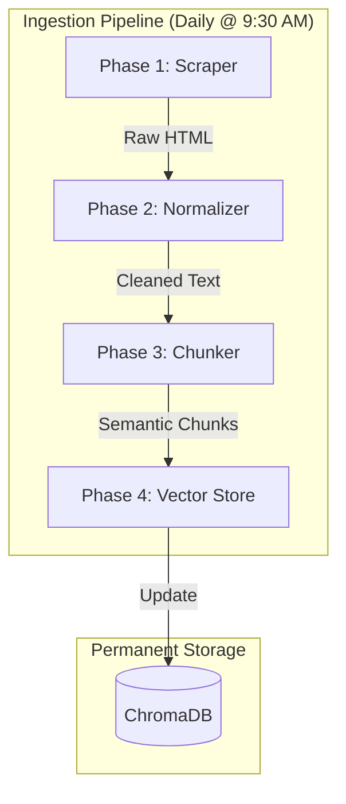
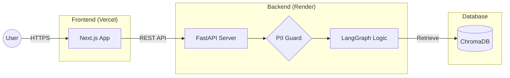

# RAG Architecture: HDFC Mutual Fund FAQ Assistant

This document describes the complete retrieval-augmented generation (RAG) architecture for the facts-only mutual fund FAQ assistant defined in `Docs/Problem_statement.md`. It prioritises accuracy, provenance, and regulatory compliance over open-ended conversational ability.

---

## 1. Design Principles

| Principle | Implication for architecture |
|---|---|
| **Facts-only** | Retrieval gates what the model may say; system prompts and post-checks forbid advice and comparisons. |
| **Single canonical source per answer** | Retrieval returns chunks tagged with one citation URL; generation is constrained to cite that URL only. |
| **Curated corpus** | Ingestion is batch or Docker-scheduled from an allowlist of URLs; no arbitrary web crawling at query time. |
| **No PII** | No user document upload path; regex-based PII guards (PAN, Aadhaar) block processing before retrieval; chat payloads exclude identifiers. |
| **Accuracy over "intelligence"** | Prefer abstention ("I couldn't find this in the indexed sources") or refusal over speculative answers. |
| **Separation of concerns** | Offline ingestion pipeline and online query API are distinct Docker services sharing only a persistent ChromaDB volume. |

---

## 2. Components in Brief

| Component | Responsibility |
|---|---|
| **Docker Compose Orchestrator** | Runs two services (`api`, `ingestion`) sharing a named volume `chroma_data` mapped to `/app/chroma_db`. See §4.0. |
| **Ingestion Worker (Docker service)** | On startup (or on schedule), reads the URL allowlist, fetches every page via `AsyncHtmlLoader` + Playwright, normalises → chunks → embeds (Gemini Embedding) → upserts into ChromaDB. |
| **System Orchestrator** | `orchestrator/run_pipeline.py` & `orchestrator/scheduler.py` | Manages the background data lifecycle. |
| **ChromaDB (Shared Volume)** | On-disk PersistentClient at `/app/chroma_db`, collection `hdfc_funds`. Written by the ingestion worker, read by the API at query time. |
| **FastAPI Backend (Docker service)** | Exposes `POST /chat`, `GET /health`. Receives user message + `thread_id`, invokes the LangGraph state machine, returns `{ response, intent, citation }`. |
| **LangGraph State Machine** | Six-node directed graph: `classify_intent → safety_guard → [greeting | refusal | retrieval → generation]`. Compiled with `MemorySaver` checkpointer for per-thread persistence. |
| **Query Router (Intent Classifier)** | Gemini Flash zero-shot classification into `factual`, `advisory`, `greeting`, or `privacy_risk` before any retrieval occurs. |
| **Hybrid Retriever** | `EnsembleRetriever` (60% dense vector / 40% BM25 keyword) pulling top-k=3 chunks per method from ChromaDB. |
| **Generation Node** | Gemini Flash with strict system prompt: ≤ 3 sentences, facts-only, no advice, exactly one citation URL + `Last updated from sources: <date>` footer. |
| **Safety & Refusal Layer** | Regex PII detection (PAN/Aadhaar) in `safety_guard_node`; templated polite refusal with AMFI educational link for advisory queries. |
| **Next.js Frontend** | `frontend_next_js/` — React SPA with dark mode toggle, Groww-inspired UI (`#00D09C`), glassmorphism, starter question chips. Communicates with FastAPI via `fetch()` to `POST /chat`. |

---

## 3. Corpus & Data Model

### 3.1 Scope (current corpus)

**AMC:** HDFC Mutual Fund.
**Source type:** Groww scheme page HTML (no PDFs in this phase).
**URL registry:** Hardcoded list `URLS` in `config/url_registry.json` | 5 Groww scheme page URLs. Extend by appending to this list.

**Allowlisted URLs:**

| Scheme | URL |
|---|---|
| HDFC Mid Cap Opportunities Fund | `https://groww.in/mutual-funds/hdfc-mid-cap-fund-direct-growth` |
| HDFC Flexi Cap Fund (Equity Fund) | `https://groww.in/mutual-funds/hdfc-flexi-cap-fund-direct-growth` |
| HDFC Focused 30 Fund | `https://groww.in/mutual-funds/hdfc-focused-30-fund-direct-growth` |
| HDFC ELSS Tax Saver Fund | `https://groww.in/mutual-funds/hdfc-elss-tax-saver-fund-direct-plan-growth` |
| HDFC Top 100 Fund (Large Cap) | `https://groww.in/mutual-funds/hdfc-top-100-fund-direct-growth` |

**Out of scope for now:** AMC PDFs (KIM, SID), standalone factsheet PDFs, AMFI/SEBI pages, and additional URLs. The ingestion pipeline should be built so PDFs and extra allowlist entries can be added later without redesign.

**Note:** The problem statement targets official AMC / AMFI / SEBI sources. This phase uses Groww pages as the curated HTML corpus; expanding to primary documents is a future corpus upgrade.

### 3.2 Document metadata (per chunk)

Store at minimum:

| Field | Purpose |
|---|---|
| `source` | Canonical page URL, used as the citation link (exactly one per assistant message). |
| `source_type` | Currently `official_groww_page`; later `factsheet`, `kim`, `sid`, `amfi`, `sebi` as corpus expands. |
| `scheme_name` | Scheme name derived from URL slug (e.g., "Hdfc Mid Cap Fund Direct Growth"). |
| `asset_management_company` | AMC identifier, currently always `HDFC Mutual Fund`. |
| `last_updated` | ISO date of scrape run (populates the `Last updated from sources:` footer). |
| `content_hash` | *(Planned)* Detect content drift on re-crawl; skip re-embedding when unchanged. |

---

## 4. Ingestion Pipeline (Detailed)

### 4.0 Scheduler & Infrastructure — Docker Compose

**Manual runs:** Without Docker, the ingestion script can be executed directly: `python orchestrator/run_pipeline.py` from the project root.

**Product default:** The ingestion service runs a lightweight Python scheduler natively inside its Docker container (`orchestrator/scheduler.py`). It executes an initial pipeline run immediately on startup, writes an `initial_boot_complete.flag`, and then enters an idle wait state, executing daily at **09:30 AM (Asia/Kolkata)**.

**Implementation:** `docker-compose.yml` at the project root defines:

| Service | Image | Purpose | Exposed Ports |
|---|---|---|---|
| `api` | `Dockerfile` (Python 3.11 + Playwright) | FastAPI backend serving LangGraph queries | `8001:8001` |
| `ingestion` | Same `Dockerfile` | Runs `scheduled_ingestion.py` daily | None |

**Shared State:** Both services mount a Docker named volume `chroma_data` to `/app/chroma_db` and `manifests_data` to `/app/data/manifests`.

---

### 4.1 Stages

The ingestion pipeline transforms raw HTML into searchable vector embeddings through a multi-phase sequence.

---

## 5. Runtime Query Pipeline — LangGraph State Machine

**Implementation:** `core/graph.py`, `core/nodes.py`, `core/state.py`, `core/retriever.py`.

### 5.1 Graph topology

The query logic is modelled as a directed state machine within the cloud-native infrastructure.

**Routing logic (`route_after_safety`):**
- `privacy_risk` → `END` (response already set by safety_guard).
- `greeting` → `greeting` node → `END`.
- `advisory` → `refusal` node → `END`.
- Everything else → `retrieval` → `generation` → `END`.

---

## 11. Technology Stack

| Layer | Choice | Notes |
|---|---|---|
| **Infrastructure** | Docker Compose (`Dockerfile` + `docker-compose.yml`) | Two services: `api` + `ingestion`, shared `chroma_data` volume. |
| **Vector DB** | ChromaDB — `PersistentClient` on disk at `./chroma_db` | Collection: `hdfc_funds`. Same path at ingest and query time. |
| **Embeddings** | Google Gemini `models/gemini-embedding-001` | Requires `GOOGLE_API_KEY`. |
| **LLM** | Gemini 1.5 Flash | Temperature 0. |
| **Orchestration** | LangGraph `StateGraph` | Multi-node state machine. |
| **Frontend** | Next.js | Tailwind CSS & Glassmorphism. |

---

## 14. Summary

The architecture is a **closed-book RAG system** designed for production reliability. It converts raw HTML into semantic vector embeddings daily and serves them via a deterministic LangGraph state machine, ensuring every answer is grounded in official data and every user interaction is secure.
