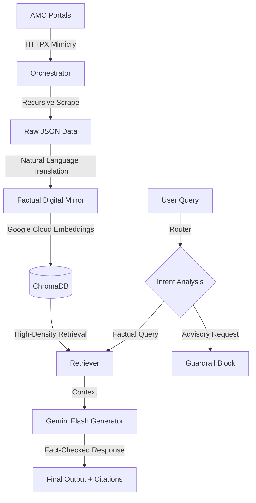

# 🏗️ Groww-Factor Architecture Deep-Dive

Groww-Factor is a high-precision RAG (Retrieval-Augmented Generation) system built to solve the "Hallucination Problem" in financial AI. Instead of relying on fuzzy text chunks, it implements a **Digital Mirror** architecture that translates official JSON data into a dedicated factual vector store.

---

## 1. System Workflow

---

## 2. The "Digital Mirror" Ingestion Pipeline

The Orchestrator is the heart of the system, designed for zero-latency factual alignment.

- **Recursive Mimicry**: Uses high-fidelity browser headers to extract `__NEXT_DATA__` from Groww/AMC portals, bypassing standard scraping blocks.
- **Factual Translation Engine**: Instead of raw text, the system converts data points into natural language "Fact Sentences":
  > `{"nav": 221.61}` → *"The latest NAV for HDFC Mid Cap Direct is Rs 221.61."*
- **Persistent Indexing**: Facts are encoded using `models/gemini-embedding-001`. This model was selected during the **Production Migration Phase** to ensure zero-compilation deployment on Render.

---

## 3. Intelligence Module (LangGraph)

The system utilizes a state-machine based routing logic to ensure strict compliance with financial regulations.

| Component | Responsibility |
| :--- | :--- |
| **Router** | Identifies if a query is factual (safe) or advisory (blocked). |
| **PII Guard** | Strips any sensitive user information before processing. |
| **Vector Retriever** | Uses semantic similarity to find the exact "Digital Mirror" facts. |
| **Facts-Only Generator** | A strictly-prompted Gemini model that refuses to hallucinate beyond the retrieved fact. |

---

## 4. Production Engineering & DevOps

One of the project's key strengths is its stable production architecture:

- **Render Backend**: A FastAPI server configured for high-concurrency processing with `PYTHONUNBUFFERED` logging.
- **Vercel Frontend**: A Next.js 14 application with a custom, Groww-inspired liquid UI that is fully mobile-responsive.
- **Automated Sync**: A GitHub Action (`daily_ingest.yml`) triggers every 24 hours to ensure the "Digital Mirror" reflects the latest NAV and AUM changes.

---

## 5. Security & Verification

- **Admin Ingestion**: Secured via `ADMIN_SECRET_KEY` and HMAC-verified tokens.
- **Test Suite**: A robust suite in `tests/` covering API endpoints, Generation accuracy, and PII masking, providing proof of system robustness.
