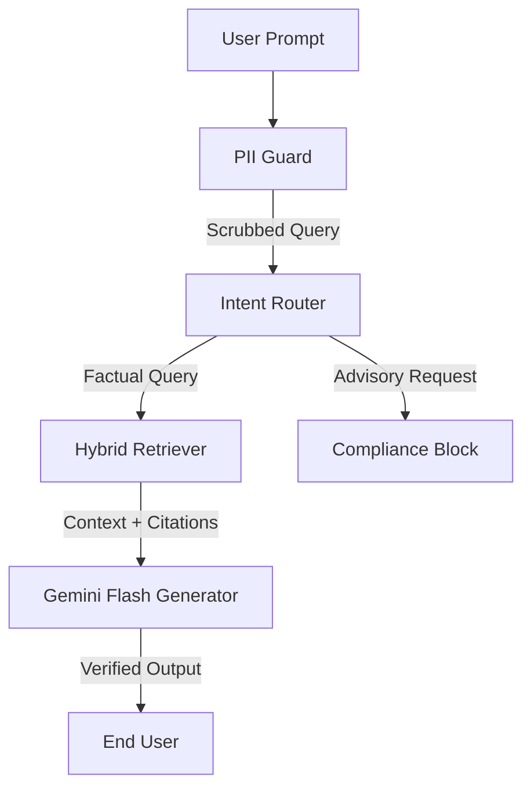

# 🏗️ Groww-Factor: Technical Architecture Specification

Groww-Factor is a production-grade RAG (Retrieval-Augmented Generation) system optimized for financial data integrity. This document provides the deep-dive technical reasoning behind our architectural choices.

---

## 1. The Technology Stack & Rationale

| Layer | Component | Selection Rationale |
| :--- | :--- | :--- |
| **LLM Model** | **Gemini 1.5 Flash** | Chosen for its **High-Speed** inference and superior **JSON/Structure understanding**, which is critical for parsing complex fund metadata without hallucinations. It provides 1M+ context window while maintaining low latency. |
| **Embeddings** | **Google GenAI (`gemini-embedding-001`)** | **Strategic Pivot**: We initially tested BGE via FastEmbed, but pivoted to Google Cloud Embeddings to ensure **zero-compilation builds on Render**. It eliminates Rust dependencies and leverages cloud-scale vectorization with 0MB impact on local RAM. |
| **Orchestration** | **LangGraph** | Provides **State-Machine Control**. Unlike linear chains, LangGraph allows for **Conditional Routing** (Safety Guardrails) and **PII Scrubbing** before the data reaches the LLM. |
| **Vector Store** | **ChromaDB** | Selected for its **Lightweight Footprint** and reliability in containerized environments. It stores the "Digital Mirror" facts with high-fidelity consistency. |
| **Frontend** | **Next.js 14** | Chosen for **Server-Side Rendering (SSR)** and **Liquid Responsiveness**, providing a premium, app-like experience on both mobile and desktop. |

---

## 2. The "Digital Mirror" Ingestion Pipeline

The core innovation of Groww-Factor is the translation of raw web data into a "Factual Mirror."

### Supported Fund Universe (Master Registry)
The system maintains a strictly-defined knowledge boundary through the following official AMC sources:

1.  **HDFC Mid Cap Opportunities Fund**  
    🔗 [Source](https://groww.in/mutual-funds/hdfc-mid-cap-opportunities-fund-direct-growth)
2.  **HDFC Flexi Cap Fund**  
    🔗 [Source](https://groww.in/mutual-funds/hdfc-equity-fund-direct-growth)
3.  **HDFC Focused 30 Fund**  
    🔗 [Source](https://groww.in/mutual-funds/hdfc-focused-fund-direct-growth)
4.  **HDFC ELSS Tax Saver Fund**  
    🔗 [Source](https://groww.in/mutual-funds/hdfc-elss-tax-saver-fund-direct-plan-growth)
5.  **HDFC Silver ETF Fund of Fund**  
    🔗 [Source](https://groww.in/mutual-funds/hdfc-silver-etf-fof-direct-growth)

### Ingestion Logic:
- **Recursive Mimicry**: The scraper simulates a high-fidelity browser environment to extract `__NEXT_DATA__` JSON blobs.
- **Natural Language Translation**: Raw data is converted into high-density fact sentences:  
  *Example:* `{"nav": 221.6}` → *"The confirmed NAV for HDFC Mid Cap is Rs 221.6."*
- **Batch Embedding**: Chunks are processed in batches of 30 to stay within Google API rate limits while maximizing indexing speed.

---

## 3. Intelligence & Safety Flow (LangGraph)

The user's query follows a strict 4-stage processing pipeline to ensure safety and precision:

1.  **PII Guard**: Masks names, emails, and phone numbers to ensure user privacy.
2.  **Hybrid Retriever**: Combines **Vector Similarity (Semantic)** with **BM25 (Keyword)** search. This ensures that a query for "NAV" (keyword) is just as accurate as a query for "What is the price?" (semantic).
3.  **Hallucination Shield**: The System Prompt forces the model to cite the specific source URL and refuse to generate data not found in the "Digital Mirror."

---

## 4. Production Performance Tuning

To satisfy **Render's Free Tier (512MB RAM)** constraints, we implemented:
- **Streaming Chunks**: To prevent memory spikes during ingestion.
- **Persistent Vector Cache**: Avoiding redundant cloud calls on every restart.
- **Concurrent API Proxy**: The Next.js frontend uses a local `/api` proxy to handle CORS and improve cross-region latency.
