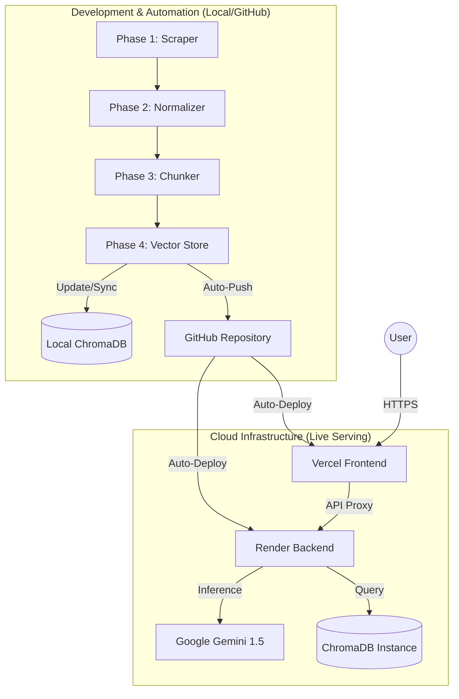

# RAG Architecture: HDFC Mutual Fund FAQ Assistant

This document describes the complete retrieval-augmented generation (RAG) architecture for the facts-only mutual fund FAQ assistant defined in `Docs/Problem_statement.md`. It prioritises accuracy, provenance, and regulatory compliance over open-ended conversational ability.

---

## 1. Design Principles

| Principle | Implication for architecture |
|---|---|
| **Facts-only** | Retrieval gates what the model may say; system prompts and post-checks forbid advice and comparisons. |
| **Single canonical source per answer** | Retrieval returns chunks tagged with one citation URL; generation is constrained to cite that URL only. |
| **Curated corpus** | Ingestion is batch or Docker-scheduled from an allowlist of URLs; no arbitrary web crawling at query time. |
| **No PII** | No user document upload path; regex-based PII guards (PAN, Aadhaar) block processing before retrieval; chat payloads exclude identifiers. |
| **Accuracy over "intelligence"** | Prefer abstention ("I couldn't find this in the indexed sources") or refusal over speculative answers. |
| **Separation of concerns** | Offline ingestion pipeline and online query API are distinct Docker services sharing only a persistent ChromaDB volume. |

---

## 2. System Lifecycle — End-to-End Flow

The diagram below provides a high-fidelity overview of the entire system, from local automation to cloud serving.

---

## 3. Components in Brief

| Component | Responsibility |
|---|---|
| **Docker Compose Orchestrator** | Runs two services (`api`, `ingestion`) sharing a named volume `chroma_data` mapped to `/app/chroma_db`. |
| **Ingestion Worker (Docker service)** | On startup (or on schedule), reads the URL allowlist, fetches every page via `AsyncHtmlLoader` + Playwright, normalises → chunks → embeds → upserts into ChromaDB. |
| **System Orchestrator** | `orchestrator/run_pipeline.py` & `orchestrator/scheduler.py` | Manages the background data lifecycle and state tracking. |
| **ChromaDB (Shared Volume)** | On-disk PersistentClient at `/app/chroma_db`. Written by the ingestion worker, read by the API at query time. |
| **FastAPI Backend (Docker service)** | Exposes `POST /chat`, `GET /health`. Receives user message + `thread_id`, invokes the LangGraph state machine, returns `{ response, intent, citation }`. |
| **LangGraph State Machine** | Six-node directed graph: `classify_intent → safety_guard → [greeting | refusal | retrieval → generation]`. |
| **Hybrid Retriever** | `EnsembleRetriever` (60% dense vector / 40% BM25 keyword) pulling top-k=3 chunks per method from ChromaDB. |
| **Next.js Frontend** | `frontend_next_js/` — React SPA with dark mode toggle, Groww-inspired UI (`#00D09C`), glassmorphism, starter question chips. |

---

## 4. Corpus & Data Model

### 4.1 Scope (current corpus)

**AMC:** HDFC Mutual Fund.
**Source type:** Groww scheme page HTML (no PDFs in this phase).
**URL registry:** Hardcoded list `URLS` in `config/url_registry.json`.

**Allowlisted URLs:**

| Scheme | URL |
|---|---|
| HDFC Mid Cap Opportunities Fund | `https://groww.in/mutual-funds/hdfc-mid-cap-fund-direct-growth` |
| HDFC Flexi Cap Fund (Equity Fund) | `https://groww.in/mutual-funds/hdfc-flexi-cap-fund-direct-growth` |
| HDFC Focused 30 Fund | `https://groww.in/mutual-funds/hdfc-focused-30-fund-direct-growth` |
| HDFC ELSS Tax Saver Fund | `https://groww.in/mutual-funds/hdfc-elss-tax-saver-fund-direct-plan-growth` |
| HDFC Top 100 Fund (Large Cap) | `https://groww.in/mutual-funds/hdfc-top-100-fund-direct-growth` |

---

## 5. Ingestion Pipeline (Detailed)

### 5.1 Stages

The ingestion pipeline transforms raw HTML into searchable vector embeddings through a multi-phase sequence, as seen in the **Stage 1** subgraph above.

| Stage | Implementation | Details |
|---|---|---|
| **Phase 1: Fetch** | `AsyncHtmlLoader(URLS)` | Uses Playwright under the hood for JS-rendered pages. |
| **Phase 2: Normalise** | `Html2TextTransformer` | Strips HTML to plain text, removes empty lines, enriches metadata. |
| **Phase 3: Chunk** | `RecursiveCharacterTextSplitter` | size=800, overlap=100. |
| **Phase 4: Index** | `Chroma.from_documents` | Local PersistentClient; persists to disk. |

### 5.2 Failure handling

| Failure Mode | Current Behaviour |
|---|---|
| Non-2xx response | `AsyncHtmlLoader` raises exception; script logs and continues. |
| Empty HTML | Document is rejected by the quality validator. |
| API key missing | Pipeline returns early with a fatal error. |

---

## 6. Runtime Query Pipeline — LangGraph State Machine

**Implementation:** `core/graph.py`, `core/nodes.py`, `core/state.py`.
**Orchestration:** LangGraph `StateGraph` compiled with `MemorySaver`.

**Routing logic (`route_after_safety`):**
- `privacy_risk` → `END`.
- `greeting` → `greeting` node → `END`.
- `advisory` → `refusal` node → `END`.
- Everything else → `retrieval` → `generation` → `END`.

---

## 7. Technology Stack

| Layer | Choice | Notes |
|---|---|---|
| **Infrastructure** | Docker Compose | Multi-container setup for local reliability. |
| **Vector DB** | ChromaDB | Collection: `hdfc_funds`. |
| **Embeddings** | Google Gemini `models/gemini-embedding-001` | High-dimensional semantic vectors. |
| **LLM** | Google Gemini 1.5 Flash | Fast, high-reasoning engine for factual extraction. |
| **Orchestration** | LangGraph `StateGraph` | Deterministic agent orchestration. |
| **Frontend** | Next.js | Modern React framework with dynamic theming. |
| **System Orchestration** | `run_pipeline.py` & `scheduler.py` | State-aware background automation. |

---

## 8. Summary

The architecture is a **closed-book RAG system** designed for production reliability. It maintains a secure boundary between your data ingestion (Local Automation phase) and your user interactions (Cloud Serving phase), ensuring every answer is grounded, cited, and compliant with financial regulations.
