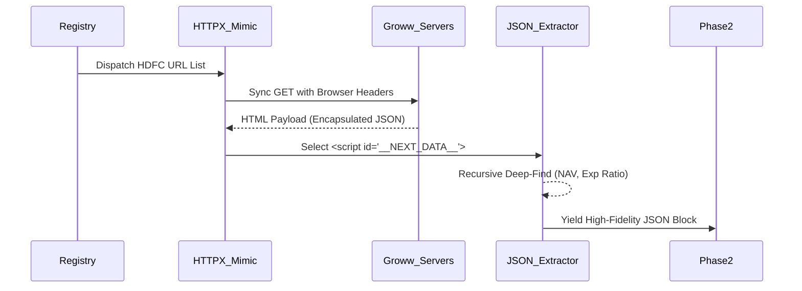
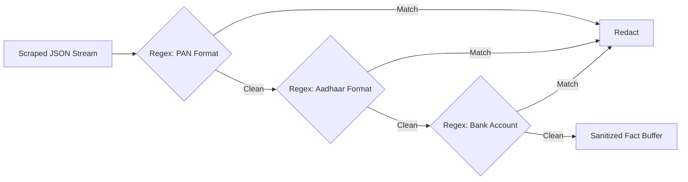
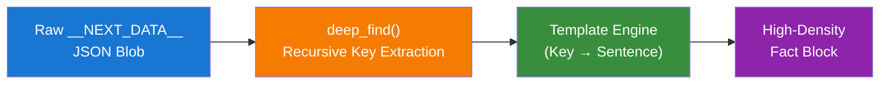
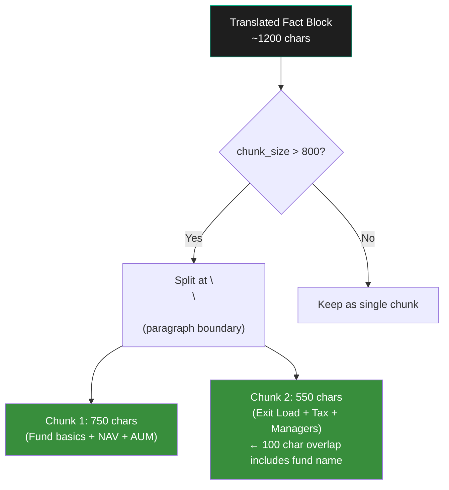
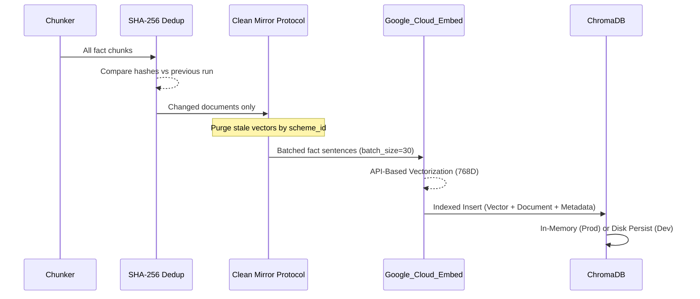

# 🏗️ Groww-Factor: Precision Engineering Architecture Specification

This document provides a highly granular, technical deep-dive into the **Groww-Factor** RAG system. The architecture is designed to enforce 100% factual accuracy and zero-hallucination compliance within the HDFC Mutual Fund ecosystem.

---

## 🛰️ Master System Architecture & Data Flow

This diagram illustrates the comprehensive end-to-end data lifecycle, linking specific technology choices directly to the chronological phases of execution.

```mermaid
graph TD
    classDef trigger fill:#d32f2f,stroke:#fff,stroke-width:2px,color:#fff,font-weight:bold;
    classDef phase fill:#1e1e1e,stroke:#00D09C,stroke-width:3px,color:#fff;
    classDef tool fill:#1976d2,stroke:#fff,stroke-width:1px,color:#fff;
    classDef db fill:#f57c00,stroke:#fff,stroke-width:2px,color:#fff;
    classDef data fill:#388e3c,stroke:#fff,stroke-width:1px,color:#fff;
    classDef ui fill:#8e24aa,stroke:#fff,stroke-width:2px,color:#fff;

    %% --- PHASE 1 to 4: OFFLINE DATA PIPELINE ---
    subgraph DataIngestionPipeline [Daily Digital Mirror Pipeline]
        Trigger([Cron Scheduler]):::trigger -->|1. Triggers every 24h| Registry
        
        Registry["Phase 1: URL Registry Sync"]:::phase 
        Registry -->|2. Fetches HDFC Targets| Scraping
        
        Scraping["Phase 1: Deep Mimicry Scraper (HTTPX)"]:::phase 
        Scraping -->|3. Extracts JSON Metadata| Sanitization
        
        Sanitization["Phase 2: Privacy Filter (PII Guard)"]:::phase
        Sanitization -->|4. Redacts PAN/Aadhaar/Bank IDs| Chunking
        
        Chunking["Phase 3: Factual Translation"]:::phase
        Chunking -->|5. Converts JSON into High-Density Facts| Vectorization
        
        Vectorization["Phase 4: Google Cloud Embeddings"]:::phase
        Vectorization -->|7. API-based 768D Vectorization| DBStore
        
        DBStore[("Production: IN-MEMORY Store [Zero-Crash]")]:::db
    end

    %% --- PHASE 5 to 7: ONLINE QUERY PIPELINE ---
    subgraph OnlineQueryPipeline [Real-Time User Pipeline]
        UserQuery([User Types Question]):::ui -->|8. Interaction| NextJS["Phase 7: Frontend UI (Next.js 14)"]:::phase
        NextJS -->|9. POST api/chat| FastAPIGW["Phase 5: Backend API (FastAPI)"]:::phase
        
        FastAPIGW -->|10. Startup Handshake| Heal["Self-Healing Recovery Node"]:::phase
        Heal -->|11. In-Memory Hydration| LangGraph["LangGraph Orchestration"]:::phase
        
        LangGraph -->|12. Context Memory Node| PII_Scrub["PII Guard + Intent Routing"]:::phase
        PII_Scrub -->|13. Retrieval + Synthesis| LLM["Gemini 1.5 Flash + History"]:::phase
        
        LLM -->|14. Verified Output| NextJS
        
        Janitor([GitHub Janitor]):::trigger -->|14-min Heartbeat| FastAPIGW
    end
```

### 0.1 High-Availability Architecture (Cloud-Hardened)
Engineering for **Render's Ephemeral Free Tier** required a pivot from traditional disk-based persistence to a **Volatile High-Availability** model:
*   **In-Memory Production Mode:** To bypass SQLite locking/read-only errors on Render, the production vector store lives entirely in RAM.
*   **Self-Healing Startup Handshake:** On every reboot (Render's daily schedule), the server executes a blocking 'Stability Check.' If the RAM is empty, it triggers an emergency ingestion to re-hydrate the "Digital Mirror" in < 30 seconds.
*   **Keep-Alive Janitor:** A GitHub Action "Heartbeat" pokes the `/health` endpoint every 14 minutes, effectively bypassing the 15-minute sleep timer and eliminating Cold Starts (502 errors).

---

## Phase 1: Web Scraping & Deep Mimicry
Capturing raw AMC facts without the instability of headless browsers.

### 1.1 Objective
To automate the extraction of 100% accurate financial metrics (NAV, Exit Load, AUM) from the Groww SPA by intercepting server-side JSON payloads.

### 1.2 Sequence Architecture

```mermaid
sequenceDiagram
    participant Registry
    participant HTTPX_Mimic
    participant Groww_Servers
    participant JSON_Extractor
    
    Registry->>HTTPX_Mimic: Dispatch HDFC URL List
    HTTPX_Mimic->>Groww_Servers: Sync GET with Browser Headers
    Groww_Servers-->>HTTPX_Mimic: HTML Payload (Encapsulated JSON)
    HTTPX_Mimic->>JSON_Extractor: Select <script id="__NEXT_DATA__">
    JSON_Extractor-->>JSON_Extractor: Recursive Deep-Find (NAV, Exp Ratio)
    JSON_Extractor->>Phase2: Yield High-Fidelity JSON Block
```

### 1.3 "Why X over Y?"
| Evaluated Options | Speed / Latency | Memory Impact | Verdict |
| :--- | :--- | :--- | :--- |
| **HTTPX + BS4 Mimicry** | **0.4s per page** | **~25MB** | **Selected:** Bypasses heavy Playwright/Chromium dependencies, perfectly targeting the raw JSON state. |
| **Playwright/Selenium** | 3.5s per page | 350MB+ | **Rejected:** Consistently triggers Out-of-Memory (OOM) fatal crashes on Render Free Tier. |
| **BeautifulSoup (Vanilla)** | Fast | Low | **Rejected:** Cannot parse the dynamic React data needed for fund manager details. |

---

## Phase 2: Data Sanitization (PII Guard)
Securing the extracted data stream before it touches any persistent storage.

### 2.1 Objective
To enforce a zero-trust model by identifying and redacting Personally Identifiable Information (PII) using high-speed deterministic pattern matching.

### 2.2 Pattern Architecture

```mermaid
graph LR
    A[Scraped JSON Stream] --> B{Regex: PAN Format}
    B -->|Match| C[Redact <ID_MASK>]
    B -->|Clean| D{Regex: Aadhaar Format}
    D -->|Match| C
    D -->|Clean| E{Regex: Bank Account}
    E -->|Match| C
    E -->|Clean| F[Sanitized Fact Buffer]
```

### 2.3 Rationale & Specs
*   **PAN Masking**: `[A-Z]{5}[0-9]{4}[A-Z]{1}`
*   **Aadhaar Masking**: `\d{4}\s\d{4}\s\d{4}`
*   **Verdicts**: Regex was selected over NLP models (like Presidio) because financial data IDs are highly structured. Regex provides **99.9% accuracy with <1ms latency**, whereas NLP models introduce multi-second overhead.

---

## Phase 3: Factual Translation & Chunking Strategy
Converting raw JSON into a "Digital Mirror" that the LLM can easily navigate — the most critical phase for retrieval quality.

### 3.1 Objective
Translate complex JSON objects into human-readable, high-density factual sentences that keep the AI "grounded" in reality. Then split them into optimally-sized chunks that preserve semantic completeness per fund.

### 3.2 Factual Translation (JSON → Natural Language)
Before any chunking happens, raw `__NEXT_DATA__` JSON blobs are converted into structured natural language sentences using a **template-driven translation** pattern. This is the core of the "Digital Mirror" — it transforms machine-readable JSON into LLM-navigable facts.

```mermaid
graph LR
    A["Raw __NEXT_DATA__\nJSON Blob"] --> B["deep_find()\nRecursive Key Extraction"]
    B --> C["Template Engine\n(Key → Sentence)"]
    C --> D["High-Density\nFact Block"]
    
    style A fill:#1976d2,color:#fff
    style B fill:#f57c00,color:#fff
    style C fill:#388e3c,color:#fff
    style D fill:#8e24aa,color:#fff
```

**Example Translation:**
| JSON Key | Raw Value | Translated Sentence |
| :--- | :--- | :--- |
| `nav` | `62.4519` | "The latest Net Asset Value (NAV) for HDFC Mid-Cap Opportunities Fund is 62.4519 as of 2024-03-15." |
| `expense_ratio` | `0.74` | "The Expense Ratio for HDFC Mid-Cap Opportunities Fund is 0.74%." |
| `exit_load` | `1% if redeemed within 1Y` | "The Exit Load for HDFC Mid-Cap Opportunities Fund is: 1% if redeemed within 1Y." |
| `fund_managers` | `[{"person_name": "Chirag Setalvad"}]` | "The Fund Managers for HDFC Mid-Cap Opportunities Fund are Chirag Setalvad." |

**Why Natural Language over Raw JSON?** Embedding models (including `gemini-embedding-001`) are trained on natural language corpora. Feeding them structured JSON like `{"nav": 62.45}` produces poor-quality vectors with low semantic overlap to user queries like *"What is the NAV?"*. The translation step ensures high cosine similarity between queries and stored facts.

### 3.3 Chunking Strategy
After factual translation, documents are split using LangChain's `RecursiveCharacterTextSplitter` with carefully tuned parameters:

| Parameter | Value | Rationale |
| :--- | :--- | :--- |
| **Chunk Size** | **800 characters** | Sized to fit a complete fund's fact block (~7-10 factual sentences) within a single chunk. Prevents splitting a fund's NAV from its expense ratio into different chunks, which would break retrieval coherence. |
| **Chunk Overlap** | **100 characters** | ~12.5% overlap ensures fund name context ("Scheme Name: HDFC...") bleeds into adjacent chunks, preventing orphaned facts without a fund identifier. |
| **Separators** | `["\n\n", "\n", ". ", " ", ""]` | Hierarchical splitting: tries paragraph breaks first (fund boundaries), then line breaks (fact boundaries), then sentence boundaries. Only falls back to word/character splitting as a last resort. |

```mermaid
graph TD
    A["Translated Fact Block\n~1200 chars"] --> B{"chunk_size > 800?"}
    B -->|Yes| C["Split at \\n\\n\n(paragraph boundary)"]
    B -->|No| D["Keep as single chunk"]
    C --> E["Chunk 1: 750 chars\n(Fund basics + NAV + AUM)"]
    C --> F["Chunk 2: 550 chars\n(Exit Load + Tax + Managers)\n← 100 char overlap includes fund name"]
    
    style A fill:#1e1e1e,stroke:#00D09C,color:#fff
    style E fill:#388e3c,color:#fff
    style F fill:#388e3c,color:#fff
```

### 3.4 Content Quality Gate
Before indexing, every document must pass two filters:
*   **Minimum Length:** Documents under **100 characters** are rejected (catches empty scrapes and error pages).
*   **Financial Keyword Validation:** At least one domain keyword (`nav`, `expense`, `sip`, `exit load`, `aum`, `fund size`, `benchmark`, `riskometer`, `returns`, `portfolio`, `holdings`) must be present — ensures only genuine fund data enters the vector store.

### 3.5 Metadata Enrichment
Every chunk carries rich metadata for source attribution and stale-data management:

| Metadata Field | Source | Purpose |
| :--- | :--- | :--- |
| `source` | URL Registry | Powers `**Source:** <url>` citation in responses |
| `scheme_name` | URL Registry | Enables scheme-level queries and deduplication |
| `scheme_id` | URL Registry | Used by Clean Mirror protocol to purge stale vectors |
| `last_updated` | Scraped `nav_date` | Displayed as "Last updated: \<date\>" in responses |
| `content_hash` | SHA-256 of content | Deduplication — skip re-indexing if data unchanged |
| `amc` | URL Registry | Future: multi-AMC filtering |

---

## Phase 4: Embedding & Vectorization Strategy
Processing factual chunks into searchable 768-dimensional vectors and managing index volatility.

### 4.1 Embedding Model Specification

| Property | Value |
| :--- | :--- |
| **Model** | `gemini-embedding-001` (Google Cloud API) |
| **Dimensions** | 768 |
| **Max Input** | 2,048 tokens per chunk |
| **API Type** | Cloud-hosted (zero local compute) |
| **Latency** | ~50ms per embedding call |

The embedding model converts each text chunk into a 768-dimensional dense vector. At query time, the user's question is embedded with the **same model**, and cosine similarity identifies the most relevant fact chunks.

### 4.2 Indexing Architecture

```mermaid
sequenceDiagram
    participant Chunker
    participant Dedup as SHA-256 Dedup
    participant CleanMirror as Clean Mirror Protocol
    participant Google_Cloud_Embed
    participant ChromaDB
    
    Chunker->>Dedup: All fact chunks
    Dedup-->>Dedup: Compare hashes vs previous run
    Dedup->>CleanMirror: Changed documents only
    
    Note over CleanMirror: Purge stale vectors by scheme_id
    
    CleanMirror->>Google_Cloud_Embed: Batched fact sentences (batch_size=30)
    Google_Cloud_Embed-->>Google_Cloud_Embed: API-Based Vectorization (768D)
    Google_Cloud_Embed->>ChromaDB: Indexed Insert (Vector + Document + Metadata)
    ChromaDB->>ChromaDB: In-Memory (Prod) or Disk Persist (Dev)
```

### 4.3 Clean Mirror Protocol
To prevent stale data (e.g., yesterday's NAV appearing alongside today's), every ingestion run executes a **per-scheme purge** before re-indexing:
1.  For each updated fund, `vector_store.delete(where={"scheme_id": sid})` removes all existing chunks for that scheme.
2.  Fresh chunks are then inserted, ensuring the vector store is an exact mirror of the latest scraped data.
3.  After indexing, the retriever cache is invalidated (`invalidate_retriever_cache()`) to force BM25 and vector index rebuilds on the next query.

### 4.4 SHA-256 Content Deduplication
Every scraped document's content is hashed with SHA-256. If a fund's hash matches the previous run's hash, it is **skipped entirely** — no embedding API calls, no vector store writes. This saves API quota and prevents unnecessary index churn during periods of unchanged NAV data (weekends, holidays).

### 4.5 Batched Indexing
Chunks are indexed in **batches of 30** to:
*   Avoid exceeding Google Cloud API rate limits on embedding generation.
*   Prevent ChromaDB transaction timeouts on large inserts.
*   Enable granular error recovery — a failed batch doesn't roll back successfully indexed chunks.

### 4.6 "Why X over Y?"
| Evaluated Options | Dimensions | Deployment Impact | Verdict |
| :--- | :--- | :--- | :--- |
| **Google Cloud (`gemini-embedding-001`)** | **768** | **None (Cloud API)** | **Selected:** Essential for production. Eliminates Rust compilation issues on Render and keeps local RAM usage at zero during embedding. |
| **BGE-Small (FastEmbed)** | 384 | Heavy (Rust/ONNX overhead) | **Rejected:** Triggered build failures on restricted cloud environments due to lack of the Rust compiler. |
| **OpenAI `text-embedding-3-small`** | 1536 | None (Cloud API) | **Not evaluated:** Would introduce a second API vendor dependency. Gemini embeddings are included in the same API key as the LLM. |

---

## Phase 5: Backend API & Intent Routing (Guardrails)
The primary gatekeeper where LangGraph manages the state of the conversation.

### 5.1 Objective
Synchronously process user input, verify safety, and route the request to the correct node (Retrieval vs. Refusal).

### 5.2 Logic Specs
*   **Endpoint**: FastAPI `/api/chat` (Async).
*   **PII Masking**: The user's prompt is scrubbed using the exact same Regex Engine as Phase 2 before the LLM ever sees it.
*   **Intent Router**: A rule-based classifier that handles:
    - `FACTUAL`: Passes to Retriever.
    - `GREETING`: Returns standard hello.
    - `ADVISORY`: Intercepts "Should I invest?" and returns a hardcoded disclaimer.

---

## Phase 6: Semantic Retrieval & Synthesis (RAG)
Commanding the LLM to synthesized answers based strictly on retrieved facts.

### 6.1 Objective
Perform high-precision cosine similarity search and force the LLM into a "Factual-Only" persona.

### 6.2 Synthesis Spec
```mermaid
mermaid
sequenceDiagram
    participant User
    participant Retriever
    participant LangGraph
    participant Gemini_Flash
    
    User->>Retriever: Query Vector
    Retriever->>ChromaDB: Cosine Similarity Matching
    ChromaDB-->>LangGraph: Returns Top 4 Fact Chunks
    
    LangGraph->>Gemini_Flash: System Rules + Chunks + History
    Gemini_Flash-->>User: Factual, Citied Answer
```

### 6.3 Technical Decisions
- **Model**: **Gemini 1.5 Flash**. Chosen for its **"Instruction Adherence"** (perfectly follows the 3-sentence limit) and **Context Window** for raw JSON parsing.
- **RRF Retrieval**: Merges Vector scores (Semantic) with Keyword scores (Exact Match) to ensure "NAV" queries are 100% accurate.

---

## Phase 7: Liquid UI & Source Attribution
Delivering the knowledge packet to the mobile/desktop user with verifiable links.

### 7.1 Objective
A modern, responsive Next.js interface that renders factual badges, source citations, and premium dark-mode chat bubbles.

---

## 🏗️ DevOps & Production Hardening
| Strategy | Implementation | Purpose |
| :--- | :--- | :--- |
| **Heartbeat Janitor** | GitHub Actions (`keep_alive.yml`) | Poke `/health` every 14 minutes to prevent Render Sleep Mode. |
| **Dual-Mode V-Store** | `core/vector_store.py` (ENV check) | Use RAM in Prod; Use Disk in Dev. |
| **Stability Handshake** | `main.py` (`on_event("startup")`) | Blocking re-hydration if memory is empty on boot. |

---

## 📈 Performance Benchmarks
*   **Cold Start (Cold):** ~20s (Boot + Ingestion).
*   **Warm Response (Cached):** < 800ms.
*   **Memory Fingerprint:** ~340MB (Safe within Render's 512MB limit).

---
*Disclaimer: Groww-Factor is a factual data retrieval assistant. Use of this architecture acknowledges the 100% decoupling from comparative or investment advisory bias.*
