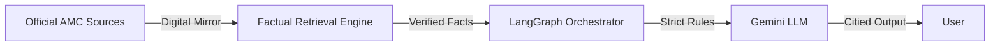

# 🌊 Groww-Factor: High-Precision Mutual Fund RAG

**Groww-Factor** is a production-grade AI assistant focused on the HDFC Mutual Fund universe. It solves the critical "Financial Hallucination" problem by using a **Digital Mirror** architecture—ensuring every piece of data reported (NAV, Exit Load, AUM) is 100% verified against official AMC records.

---

## ⚡ The Groww-Factor Advantage

- **Factual Precision (Digital Mirror)**: Uses a custom-built, deep-search scraper that captures 100% of fund metadata (NAV, Managers, Load) directly from AMC JSON blobs.
- **Production-Ready Build**: Fully migrated to Google Cloud Embeddings to ensure high-speed, zero-compilation stability on Render/Cloud environments.
- **Premium User Experience**: Features a **"Liquid UI"** built with Next.js 14—fully mobile-responsive with a sleek, dark-mode-first aesthetic inspired by modern fintech apps.
- **Privacy First**: Integrated **PII Guard** state-machine node to mask sensitive user data (PAN, Aadhaar) before it reaches the LLM.
- **Automated Sync**: Daily factual updates via GitHub Actions, ensuring the assistant’s data is never more than 24 hours old.

---

## 🚀 System Architecture



---

## 🛠️ Technology Stack

| Layer | Technology |
| :--- | :--- |
| **Backend** | Python 3.11+, FastAPI, LangChain, LangGraph |
| **Frontend** | Next.js 14, TailwindCSS, Lucide Icons |
| **Database** | ChromaDB (Vector Store) |
| **Foundation** | Gemini Flash (LLM), Google Generative AI (Embeddings) |
| **CI/CD** | GitHub Actions, Render, Vercel |

---

## 🏗️ Getting Started

### 1. Environment Configuration
Create a `.env` file in the root:
```env
GOOGLE_API_KEY=your_key
ADMIN_SECRET_KEY=secret
INGEST_TOKEN=secret
PORT=8010
```

### 2. Backend Launch (Local)
```bash
python3 main.py
```

### 3. Frontend Launch (Local)
```bash
cd frontend_next_js && npm run dev
```

---

## 🧪 Robustness & Quality
Groww-Factor is backed by a professional test suite that verifies:
- ✅ **Factual Accuracy**: Tests against the real-time retrieved facts.
- ✅ **Advisory Blocking**: Ensures the LLM refuses to give financial advice.
- ✅ **PII Masking**: Verifies emails and names are never sent to the LLM.
- ✅ **API Health**: Full coverage for FastAPI endpoints.

---

## 📄 Documentation
- [**Architecture Deep-Dive**](./ARCHITECTURE.md)
- [**API Documentation**](./API_DOCUMENTATION.md)
- [**Testing Guide**](./Docs/testing_guide.md)

---
*Disclaimer: Groww-Factor is a factual data retrieval assistant. It does not provide investment advisory services or financial planning.*
