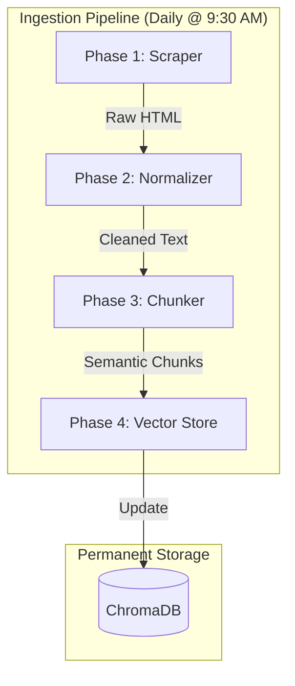
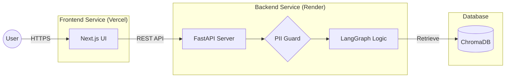

# 🚀 groww-factor: Compliance-First Mutual Fund RAG

[](https://fastapi.tiangolo.com/)
[](https://nextjs.org/)
[](https://langchain-ai.github.io/langgraph/)
[](https://docs.trychroma.com/)

**groww-factor** is a production-grade Retrieval-Augmented Generation (RAG) assistant designed for the HDFC Mutual Fund ecosystem. It prioritises **regulatory compliance**, **factual accuracy**, and **PII security** over open-ended conversation.

---

## 🌌 The Experience

Featuring a premium **twinkling space-themed UI** with glassmorphism effects, `groww-factor` provides a stunning, responsive experience for analyzing fund data.

> [!TIP]
> Ask about expense ratios, fund managers, exit loads, or NAVs. Try asking for "investment advice" to see the compliance safety guards in action!

---

## 🛠️ Architecture & Flow

### 1. Data Ingestion & Transformation (Stage: Backend)
The system operates a multi-phase ingestion sequence to transform raw financial data into semantic memory.



### 2. Live Runtime & User Interaction
A production-grade microservices flow ensures responsive queries and high security.



---

## 🔒 Key Features

- **🛡️ PII Firewall:** Standalone regex-driven guard catching PAN, Aadhaar, Emails, and Bank details before they hit the LLM.
- **⚖️ Compliance Post-Check:** Every response is validated against 10+ forbidden advisory patterns (e.g., "I recommend", "buy", "better than").
- **⚡ Hybrid Retrieval:** 60% Dense Vector / 40% BM25 Keyword search for precise numerical fact extraction.
- **📅 Automated Scheduler:** Docker-ready logic in `orchestrator/` that refreshes the knowledge base daily at 09:30 AM IST.

---

## 🚀 Quick Start

### 1. Clone & Setup
```bash
git clone https://github.com/puneet225/Milestone_1.git
cd Milestone_1
python -m venv .venv
source .venv/bin/activate
pip install -r requirements.txt
```

### 3. Run Pipeline Manually
If you want to refresh the data immediately:
```bash
python orchestrator/run_pipeline.py --force
```

### 2. Configure
Create a `.env` file from the template:
```bash
cp .env.example .env
# Add your GOOGLE_API_KEY
```

### 3. Run Locally (Docker)
```bash
docker compose up --build
```

---

## 🛠️ Technology Stack

| Component | Choice |
|---|---|
| **Frontend** | [Next.js](https://nextjs.org/) (React, TypeScript) |
| **Backend** | [FastAPI](https://fastapi.tiangolo.com/) (Python) |
| **AI Orchestration** | [LangGraph](https://langchain-ai.github.io/langgraph/) |
| **Vector Database** | [ChromaDB](https://docs.trychroma.com/) |
| **Embeddings & LLM** | [Google Gemini](https://ai.google.dev/) (Flash 1.5 & Embedding-001) |
| **Deployment** | [Vercel](https://vercel.com/) (Frontend) & [Render](https://render.com/) (Backend) |

---

## 🔗 Documentation

- [🏗️ Detailed Architecture](ARCHITECTURE.md)
- [📖 API Reference](API_DOCUMENTATION.md)
- [☁️ Deployment Guide (Render/Vercel)](DEPLOYMENT_GUIDE.md)

---

## 📜 Disclaimer
*groww-factor provides factual data sourced directly from AMC portals. It is not an investment advisory platform. Investing in Mutual Funds is subject to market risks.*
