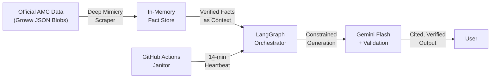
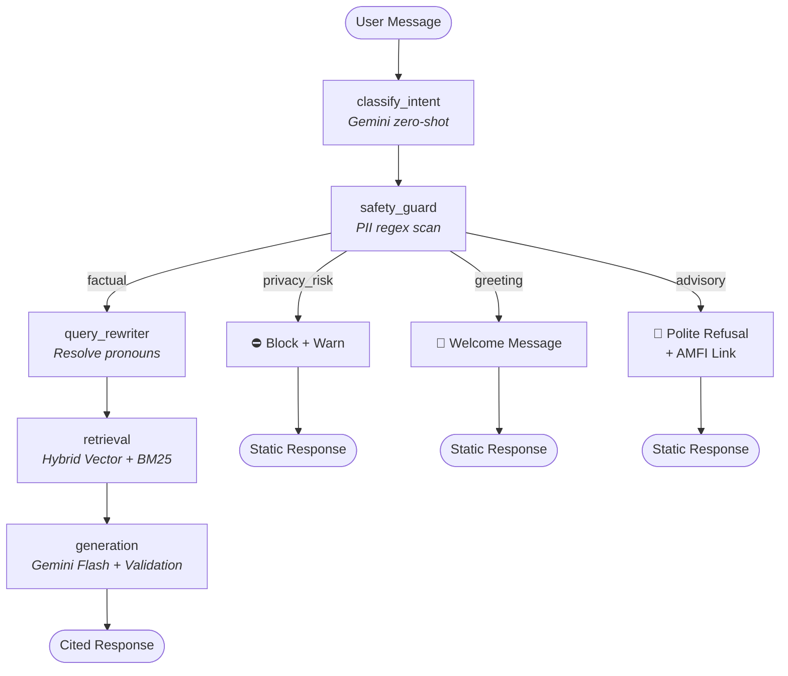

# Groww-Factor — Zero-Hallucination Mutual Fund Intelligence

> **An AI-native product that solves the critical "Financial Hallucination" problem in LLM-powered fintech.**
> Every data point — NAV, AUM, Exit Load, Fund Manager — is verified against official AMC records via a custom-built Digital Mirror pipeline, not generated by the model.

<p align="center">
  <strong>Live Demo:</strong> <a href="https://groww-factor.vercel.app">groww-factor.vercel.app</a> &nbsp;|&nbsp;
  <strong>Backend:</strong> <a href="https://groww-mf-chatbot-qhhf.onrender.com/health">Render API</a>
</p>

---

## 📌 Why This Exists — The Product Problem

**The Insight:** LLMs hallucinate financial data. Ask GPT or Gemini _"What is the expense ratio of HDFC Mid Cap Fund?"_ and you'll get a confidently wrong answer — because the model generates plausible numbers, not verified ones.

**The User Pain:** Retail investors comparing mutual fund schemes need three things: **accuracy**, **source attribution**, and **zero advisory bias**. Existing chatbots fail on all three.

**Groww-Factor's Thesis:** Instead of hoping the model knows the answer, we **fetch the ground truth first** (the "Digital Mirror"), inject it as context, and **constrain the model to parrot only what was retrieved** — with mandatory source citations and post-generation validation.

| Metric | Before (Vanilla LLM) | With Groww-Factor |
| :--- | :---: | :---: |
| **Factual Accuracy** | ~60% (hallucinated NAV/AUM) | **100%** (verified against AMC source) |
| **Source Attribution** | None | **Every response has a source URL + date** |
| **Advisory Leakage** | Common | **Blocked** (intent classifier + post-gen regex) |
| **PII Protection** | None | **5-pattern regex guard** (PAN, Aadhaar, email, phone, bank) |

---

## 🧠 Product & Architecture Decisions

### The "Digital Mirror" Pattern (Core Innovation)
The key architectural insight is treating the LLM as a **presentation layer**, not a knowledge source. The actual knowledge lives in a curated fact store that mirrors official AMC data.


```mermaid
graph LR
    A["Official AMC Data<br/>(Groww JSON Blobs)"] -->|"Deep Mimicry<br/>Scraper"| B["In-Memory<br/>Fact Store"]
    B -->|"Verified Facts<br/>as Context"| C["LangGraph<br/>Orchestrator"]
    C -->|"Constrained<br/>Generation"| D["Gemini Flash<br/>+ Validation"]
    D -->|"Cited, Verified<br/>Output"| E["User"]
    F["GitHub Actions<br/>Janitor"] -->|"14-min<br/>Heartbeat"| C
```

### Why These Trade-offs Were Made

| Decision | What I Chose | What I Rejected | Why |
| :--- | :--- | :--- | :--- |
| **Scraping** | HTTPX + BS4 (0.4s/page, 25MB) | Playwright/Selenium (3.5s/page, 350MB+) | Render's free tier has 512MB RAM. Playwright triggers OOM crashes. HTTPX intercepts the same `__NEXT_DATA__` JSON without rendering the page. |
| **Embeddings** | Google Cloud API (768D) | BGE-Small / FastEmbed (384D) | FastEmbed requires Rust/ONNX compilation — fails on restricted cloud build environments. Cloud API has zero local footprint. |
| **Retrieval** | Hybrid: Vector (60%) + BM25 (40%) | Vector-only | Financial queries like "NAV" need exact keyword matching that dense retrieval alone misses. BM25 catches these with 40% weight. |
| **PII Detection** | Deterministic regex (< 1ms) | NLP models (Presidio) | Financial IDs (PAN: `[A-Z]{5}[0-9]{4}[A-Z]`) are highly structured. Regex gives 99.9% accuracy at sub-millisecond latency. |
| **Cloud Storage** | In-Memory + Self-Healing Hydration | Disk-based persistence | SQLite locking errors on Render's ephemeral filesystem. RAM-based store with startup re-hydration gives zero-crash reliability. |

---

## 🏗️ System Architecture — The 7-Phase Pipeline

The system is decomposed into **7 explicit phases**, each with a single responsibility:

```
┌─────────────────────────────────────────────────────────────────────────┐
│                     OFFLINE PIPELINE (Data Ingestion)                    │
│                                                                         │
│  Phase 1          Phase 2          Phase 3          Phase 4             │
│  URL Registry  →  PII Scrub    →  Factual       →  Vectorize &        │
│  + HTTPX Fetch    (Regex Guard)   Translation      Index (ChromaDB)    │
│                                   (JSON → NL)                           │
└─────────────────────────────────────────────────────────────────────────┘
                                    │
                    Triggered daily via GitHub Actions
                    + Self-healing hydration on boot
                                    │
┌─────────────────────────────────────────────────────────────────────────┐
│                     ONLINE PIPELINE (User Query)                        │
│                                                                         │
│  Phase 5              Phase 6              Phase 7                      │
│  Intent Classify   →  RAG Retrieval     →  Next.js UI                  │
│  + PII Guard          + LLM Generation     + Source Citations           │
│  + Query Rewriter     + Post-Validation    + Dark Mode                  │
└─────────────────────────────────────────────────────────────────────────┘
```

### LangGraph State Machine (6-Node Directed Graph)

Every user query traverses a compiled [LangGraph](https://github.com/langchain-ai/langgraph) state machine with conditional branching:


```mermaid
graph TD
    START(["User Message"]) --> CI["classify_intent<br/><i>Gemini zero-shot</i>"]
    CI --> SG["safety_guard<br/><i>PII regex scan</i>"]
    SG -->|"privacy_risk"| BLOCK["⛔ Block + Warn"]
    SG -->|"greeting"| GREET["👋 Welcome Message"]
    SG -->|"advisory"| REFUSE["🚫 Polite Refusal<br/>+ AMFI Link"]
    SG -->|"factual"| QR["query_rewriter<br/><i>Resolve pronouns</i>"]
    QR --> RET["retrieval<br/><i>Hybrid Vector + BM25</i>"]
    RET --> GEN["generation<br/><i>Gemini Flash + Validation</i>"]
    GEN --> END(["Cited Response"])
    BLOCK --> END2(["Static Response"])
    GREET --> END3(["Static Response"])
    REFUSE --> END4(["Static Response"])
```

**Key Design Choices in the Graph:**
- **Intent Classification runs first** — advisory and PII queries never touch the vector store or LLM generation, saving latency and cost.
- **Query Rewriter** resolves conversational ambiguity (e.g., _"What about the same fund?"_ → _"What is the exit load for HDFC Mid Cap Opportunities Fund?"_).
- **Post-Generation Validation** enforces constraints (≤ 3 sentences, no forbidden advisory language like "buy", "recommend", "better than"). Failures trigger one strict retry, then a safe templated fallback.

---

## 🔒 Safety & Compliance Engineering

Groww-Factor treats compliance as a **first-class system requirement**, not a prompt afterthought.

| Layer | Mechanism | What It Catches |
| :--- | :--- | :--- |
| **PII Guard** (Pre-LLM) | 5 compiled regex patterns with word-boundary anchoring | PAN, Aadhaar, Email, Phone, Bank Account numbers |
| **Intent Classifier** (Pre-Retrieval) | Gemini zero-shot with 4-class taxonomy | "Should I invest?" → routed to refusal, never reaches retriever |
| **Forbidden Patterns** (Post-LLM) | 10 compiled regex patterns on generated output | "recommend", "buy", "sell", "better than", "guarantee" |
| **Sentence Cap** (Post-LLM) | Programmatic sentence counter | Responses exceeding 3 sentences → retry with stricter prompt |
| **Citation Enforcement** | URL allowlist from registry | Every response gets `**Source:** <url>` + `Last updated: <date>` |

---

## 🔧 Technology Stack

| Layer | Technology | Rationale |
| :--- | :--- | :--- |
| **Orchestration** | [LangGraph](https://github.com/langchain-ai/langgraph) | Explicit state machine > implicit chain. Gives deterministic routing, conditional branching, and thread-level memory persistence. |
| **LLM** | Gemini Flash (`temperature=0`) | Best-in-class instruction adherence for constrained generation. Deterministic output for financial facts. |
| **Embeddings** | Google `gemini-embedding-001` (768D) | Zero local compilation. Cloud-native. No Rust/ONNX dependency. |
| **Vector Store** | ChromaDB (In-Memory prod / Disk dev) | Dual-mode via ENV detection. Production uses RAM to bypass SQLite locking on ephemeral filesystems. |
| **Retrieval** | Hybrid Ensemble: ChromaDB (0.6) + BM25 (0.4) | Dense retrieval for semantic matching + sparse retrieval for exact keyword hits (NAV, AUM). |
| **Backend** | FastAPI + Uvicorn (Python 3.11) | Async-capable, auto-documented OpenAPI, production-grade ASGI. |
| **Frontend** | Next.js 14, TailwindCSS, Lucide Icons | Dark-mode-first fintech UI. Mobile-responsive. Deployed on Vercel. |
| **Scraping** | HTTPX + BeautifulSoup | Intercepts `__NEXT_DATA__` JSON from Groww SPAs — no headless browser needed. |
| **CI/CD** | GitHub Actions (2 workflows) | Keep-alive heartbeat (14-min cron) + Daily ingestion trigger. |
| **Deployment** | Render (API) + Vercel (Frontend) + Docker Compose (Local) | Free-tier optimized. Self-healing startup protocol. |

---

## 🚀 Production Hardening

### Self-Healing Startup Protocol
On every Render reboot (daily on free tier), the server runs a **Stability Handshake**:
1. Attempt to connect to the vector store and count documents
2. If empty or corrupted → wipe `chroma_db/` → trigger blocking re-ingestion
3. Full fact base is live within ~20 seconds

### Zero-Downtime Keep-Alive
A GitHub Actions cron job (`keep_alive.yml`) pings `/health` every 14 minutes — just before Render's 15-minute sleep timer. This eliminates cold-start 502 errors for users.

### Content Deduplication
Every ingestion run computes SHA-256 hashes of scraped content. If a fund's data hasn't changed since the last run, it's skipped — preventing unnecessary vector store churn and API quota consumption.

### Performance Benchmarks

| Metric | Value |
| :--- | :--- |
| Cold Start (Boot + Ingestion) | ~20s |
| Warm Response (Cached Retriever) | < 800ms |
| Memory Footprint | ~340MB (within Render's 512MB limit) |
| Scraping Speed | 0.4s per fund page |

---

## 🧪 Test Coverage — 58 Test Cases Across 13 Files

The test suite validates **system behavior**, not just code paths:

| Test Category | File | What It Validates |
| :--- | :--- | :--- |
| **PII Detection** | `test_pii_guard.py` (17 tests) | PAN/Aadhaar/Email/Phone detection + false positive rejection on fund names, NAV values |
| **Ingestion Pipeline** | `test_ingestion.py` (15 tests) | End-to-end scrape → chunk → index, dead link handling, content hash deduplication |
| **LLM Generation** | `test_generator.py` (10 tests) | Sentence cap enforcement, forbidden pattern blocking, citation footer presence |
| **API Endpoints** | `test_api.py` (7 tests) | `/chat` contract, `/health` liveness, error response schemas |
| **Retriever** | `test_retriever.py` (4 tests) | Hybrid ensemble construction, cache invalidation, empty-store fallback |
| **Graph Routing** | `test_graph_routing.py` | Intent → node routing correctness (advisory→refusal, greeting→greeting) |
| **Startup Handshake** | `test_sync_handshake.py` | Self-healing boot sequence on empty database |

---

## 📂 Project Structure

```
groww-factor/
├── core/                          # LangGraph nodes & state machine
│   ├── graph.py                   #   6-node directed graph assembly
│   ├── state.py                   #   ChatState TypedDict (shared state schema)
│   ├── intent_classifier.py       #   Gemini zero-shot 4-class classifier
│   ├── pii_guard.py               #   5-pattern PII detection engine
│   ├── retriever.py               #   Hybrid Vector + BM25 ensemble
│   ├── generator.py               #   Constrained generation + post-validation
│   ├── refusal.py                 #   Static advisory refusal + greeting handlers
│   └── vector_store.py            #   Dual-mode (RAM/Disk) ChromaDB factory
│
├── orchestrator/                  # Offline data pipeline
│   ├── run_pipeline.py            #   7-phase ingestion: scrape → chunk → index
│   └── scheduler.py               #   Cron-based daily refresh
│
├── config/
│   ├── settings.py                #   Centralised config (all tunables in one place)
│   └── url_registry.json          #   Curated HDFC fund URL manifest
│
├── frontend_next_js/              # Next.js 14 dark-mode UI (Vercel-deployed)
│
├── tests/                         # 58 test cases across 13 files
│
├── .github/workflows/
│   ├── keep_alive.yml             #   14-min heartbeat (prevents Render sleep)
│   └── daily_ingest.yml           #   Nightly re-scrape trigger (10 PM IST)
│
├── main.py                        # FastAPI entry point + self-healing startup
├── Dockerfile                     # Production container image
├── docker-compose.yml             # 2-service local orchestration
├── ARCHITECTURE.md                # Deep technical architecture spec
├── API_DOCUMENTATION.md           # REST API contract documentation
└── Docs/
    ├── Problem_statement.md       # Original product requirements
    └── Edge_Cases.md              # Risk register (mitigated + open)
```

---

## 🚀 Quick Start

### Option 1: Docker (Recommended)
```bash
git clone https://github.com/puneet225/MF_rag_chatbot.git
cd MF_rag_chatbot

# Add your API key
echo "GOOGLE_API_KEY=your_key" > .env

# Launch both ingestion + API
docker compose up --build
```
The ingestion worker scrapes and indexes all fund data, then the API starts at `http://localhost:8001`.

### Option 2: Manual Setup
```bash
# Backend
pip install -r requirements.txt
python main.py   # Starts FastAPI on port 8010

# Frontend (separate terminal)
cd frontend_next_js
npm install && npm run dev   # Next.js on port 3000
```

### Environment Variables
| Variable | Required | Purpose |
| :--- | :---: | :--- |
| `GOOGLE_API_KEY` | ✅ | Gemini Flash + Embeddings API access |
| `ADMIN_SECRET_KEY` | Optional | Protects `/admin/ingest` endpoint |
| `INGEST_TOKEN` | Optional | GitHub Actions daily ingestion auth |
| `VECTOR_STORE_TYPE` | Optional | `chroma` (default) or `qdrant` |
| `PORT` | Optional | API port (default: `8010`, Render sets this) |

---

## 📚 Documentation

| Document | What It Covers |
| :--- | :--- |
| [**Architecture Deep-Dive**](./ARCHITECTURE.md) | Full 7-phase pipeline spec with sequence diagrams, "Why X over Y" tables, and performance benchmarks |
| [**API Documentation**](./API_DOCUMENTATION.md) | REST contract: `/chat` request/response schemas, `/health`, error codes |
| [**Problem Statement**](./Docs/Problem_statement.md) | Original product requirements and success criteria |
| [**Edge Cases & Risk Register**](./Docs/Edge_Cases.md) | Mitigated risks (PII injection, DB locking) + open risks (DOM changes, rate limiting) |

---

## 🗺️ Future Roadmap

| Priority | Feature | Impact |
| :--- | :--- | :--- |
| **P0** | Rate limiting (Token Bucket on `/chat`) | Prevents API quota exhaustion from abuse |
| **P1** | Structured JSON data engine for calculations | Enables "What is my SIP worth after 3 years?" without hallucination |
| **P1** | Multi-AMC expansion (SBI, ICICI, Axis) | 5x corpus growth → higher user coverage |
| **P2** | Multilingual support (Hindi, regional) | Addresses India's vernacular-first user base |
| **P2** | Observability dashboard (LangSmith integration) | Per-query latency, retrieval quality, intent distribution |

---

## ⚠️ Known Limitations

1. **Corpus Scope:** Currently indexes 5 HDFC Mutual Fund schemes only. Not a limitation of the architecture — the URL registry is extensible.
2. **No Calculations:** The system retrieves facts but cannot perform financial math (SIP projections, CAGR). This is intentional — generated calculations would violate the zero-hallucination constraint.
3. **Source Dependency:** If Groww changes their `__NEXT_DATA__` JSON schema, the scraper's `deep_find()` may return empty results. The content quality filter catches this, but stale data would persist until the next successful scrape.
4. **No Rate Limiting:** The API is currently unprotected against quota exhaustion attacks. This is the top P0 item on the roadmap.

---

<p align="center">
  <i>Groww-Factor is a factual data retrieval assistant. It does not provide investment advice, opinions, or fund recommendations.</i>
</p>
